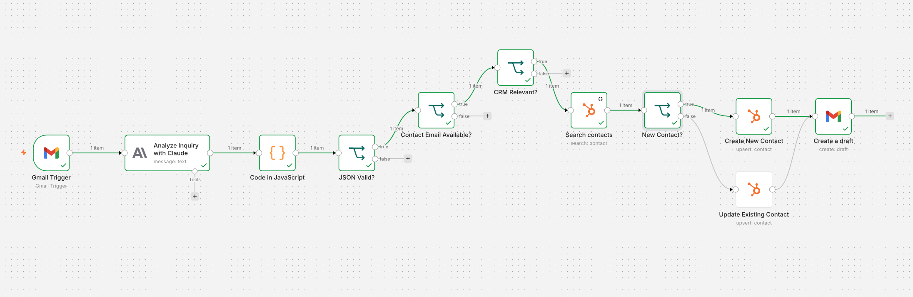
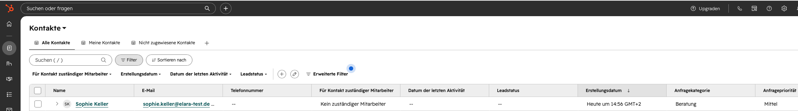
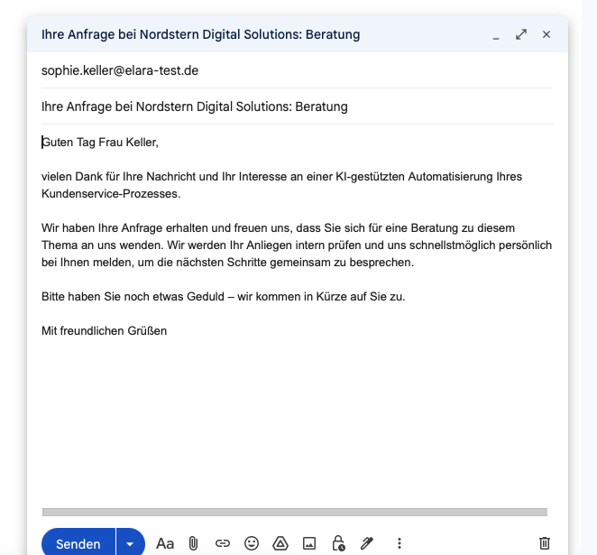

# AI Powered Lead Intake and CRM Workflow

## Project Overview

This project demonstrates an automated lead intake process that connects Gmail, Claude, n8n and HubSpot CRM.

Incoming business inquiries are automatically analyzed, structured and evaluated. Relevant requests are added to or updated in HubSpot. A professional response draft is then created in Gmail for human review.

The workflow was developed as a portfolio project based on a realistic business process. It demonstrates how AI analysis, workflow automation and CRM integration can reduce manual effort while maintaining data quality and human oversight.

## Business Scenario

Nordstern Digital Solutions GmbH is a fictional B2B company that provides CRM, process automation and AI workflow services.

The company receives consulting requests, demo requests, project inquiries, support requests and other business inquiries.

The objective is to automate the initial processing of incoming requests while ensuring that relevant information is documented in the CRM and external communication remains under human control.

## Workflow Architecture

```text
Gmail Trigger
→ Claude Analysis
→ JSON Processing
→ JSON Validation
→ Contact Email Validation
→ CRM Relevance Check
→ HubSpot Contact Search
→ Contact Creation or Update
→ Gmail Draft Creation
→ Human Review
```
## Workflow Preview



[Open workflow image in full size](images/workflow_overview.png)

## CRM Result



[Open CRM result in full size](images/hubspot_contact.png)

## Response Draft



[Open response draft in full size](images/gmail_draft.png)

## Process Logic

### 1. Email Intake

The workflow starts when a new business inquiry is received in Gmail.

The complete email content is processed so that contact information, deadlines and relevant context remain available for analysis.

### 2. AI Analysis

Claude analyzes the incoming message and returns structured information.

The model extracts:

1. Contact name
2. Contact email
3. Company
4. Inquiry category
5. Priority
6. Priority reasoning
7. CRM relevance
8. Response draft

The model does not make final business decisions and does not send emails automatically.

### 3. JSON Processing

Claude returns its analysis as JSON.

A JavaScript node removes possible Markdown formatting and converts the response into structured n8n data fields.

The node also catches invalid JSON responses and returns a controlled error value instead of allowing the workflow to fail without a defined process.

### 4. JSON Validation

The first decision node checks whether the Claude response was successfully converted into valid JSON.

If the JSON is valid, the workflow continues.

If the JSON is invalid, the workflow stops before any HubSpot or Gmail action is executed.

### 5. Contact Email Validation

The second decision node verifies that a contact email address is available.

If no contact email address is found, the workflow stops.

This prevents incomplete CRM records and Gmail drafts without a recipient.

### 6. CRM Relevance Check

The third decision node determines whether the message is relevant for the CRM.

Relevant external business inquiries continue through the workflow.

Private, internal or unrelated messages are stopped before reaching HubSpot.

### 7. HubSpot Contact Search

HubSpot searches for an existing contact using the extracted contact email address.

The workflow uses the business contact email found in the message content rather than relying only on the technical Gmail sender address.

### 8. Contact Creation or Update

The fourth decision node checks whether a HubSpot contact ID exists.

If no contact ID exists, a new contact is created.

If a contact ID exists, the existing contact is updated.

This logic reduces duplicate CRM records.

The following information is stored in HubSpot:

1. Email
2. First name
3. Last name
4. Company
5. Inquiry category
6. Inquiry priority
7. Priority reasoning

### 9. Gmail Draft Creation

After the HubSpot action, Gmail creates a professional response draft.

The draft contains:

1. The extracted contact email address
2. A subject based on the inquiry category
3. The response text generated by Claude

The email is not sent automatically.

### 10. Human Review

A person reviews the Gmail draft before sending it.

The review ensures that the response is accurate, no incorrect commitment is made, prices and deadlines are verified and the tone is appropriate.

Final communication and business decisions remain under human control.

## Technology Stack

1. n8n Cloud for workflow automation
2. Gmail for email intake and response drafts
3. Claude API for analysis and text generation
4. HubSpot CRM for contact management
5. JavaScript for JSON processing
6. GitHub for documentation and portfolio presentation

## Structured AI Output

Claude returns the following structured output:

```json
{
  "name": "",
  "email": "",
  "unternehmen": "",
  "anliegen": "",
  "kategorie": "",
  "prioritaet": "",
  "begruendung_prioritaet": "",
  "crm_relevant": true,
  "antwortentwurf": ""
}
```

## Decision Logic

The workflow contains four decision nodes.

### JSON validity

The workflow checks whether the Claude response was successfully parsed.

A parsing error stops the workflow before data reaches HubSpot or Gmail.

### Contact email availability

The workflow checks whether a usable contact email address is available.

Missing contact information stops the workflow before a CRM record or email draft is created.

### CRM relevance

The workflow checks whether the message represents a relevant external business inquiry.

Private and unrelated messages are excluded from CRM processing.

### Existing or new contact

The workflow checks whether HubSpot returned an existing contact ID.

A new contact is created when no ID exists. An existing contact is updated when an ID is available.

## Error Handling

The portfolio workflow includes controlled handling for:

1. Invalid Claude JSON output
2. Missing contact email address
3. Messages that are not relevant for the CRM
4. Existing HubSpot contacts
5. Temporary API failures through retry settings

If the Claude response cannot be parsed, the JavaScript node returns a structured parsing error. The workflow then stops before HubSpot or Gmail is executed.

If no contact email address is available, the workflow stops before creating or updating a contact.

A production implementation should additionally include central error logging, automated alerts, controlled reprocessing and retry logic with increasing waiting times.

## Testing

The workflow was tested with the following scenarios:

1. New relevant contact
2. Existing relevant contact
3. Private email
4. Consulting request
5. Demo request
6. Project inquiry
7. High priority inquiry
8. Missing contact email address
9. Invalid JSON response
10. Correct HubSpot category
11. Correct HubSpot priority
12. Complete Gmail response draft
13. Human review before sending

Detailed test cases are documented in `docs/testing.md`.

## Security and Privacy

API credentials are stored only in the n8n credential system.

No API keys, service keys, passwords or access tokens are included in this repository.

All published test data should be fictional. Screenshots and workflow exports must not contain real personal data or confidential information.

For productive use, an organization must evaluate:

1. Data protection requirements
2. Approved AI providers
3. Data processing agreements
4. Data storage locations
5. Roles and access permissions
6. Internal AI policies
7. Data retention periods
8. Human review responsibilities
9. Model governance
10. Audit requirements

Enterprise access to an AI model does not automatically ensure regulatory compliance. Compliance depends on the specific use case, technical configuration, contracts, access controls and organizational governance.

## Production Requirements

A production ready implementation should additionally include:

1. Central error logging
2. Automated alerts
3. Retry logic with increasing waiting times
4. API quota monitoring
5. Failed request reprocessing
6. Role based access control
7. Data retention rules
8. Audit documentation
9. Model approval
10. Workflow ownership
11. Maintenance responsibilities
12. Regular testing

## Repository Structure

```text
ai lead intake crm workflow
│
├── README.md
├── docs
│   └── testing.md
├── images
│   ├── workflow overview.png
│   ├── hubspot contact.png
│   └── gmail draft.png
└── workflow
    └── ai lead intake crm workflow.json
```

## Result

The final workflow demonstrates practical experience with:

1. API based system integration
2. AI supported data extraction
3. JSON processing
4. Workflow decision logic
5. CRM integration
6. Contact duplicate prevention
7. Error handling
8. Human approval processes
9. Credential and permission management
10. Business process automation

The project shows how an incoming business inquiry can be transformed into structured CRM data and a reviewable response draft through a controlled automated process.
